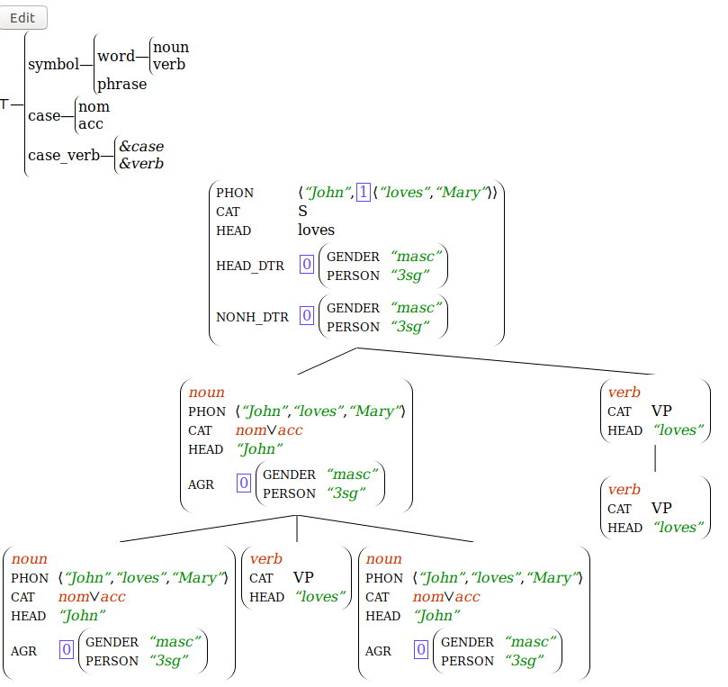

# Borjes-react

A library for displaying [borjes](https://github.com/agarsev/borjes) objects as
[React](https://reactjs.org/) components.

It allows for easy visualization and point-and-click editing of AVMs, type
lattices, parse trees, and other such objects common in unification-based
grammatical formalisms.

## Screenshots

Some example screenshots (I know they are not proper linguistics, just a demo! ;)




## Usage

See `test/main.jsx` for a quite complete example.

As a modern javascript module:

```JSX
import { Component as BorjesComponent,
    ProtoLattice as BorjesProtoLattice
} from "borjes-react";

ReactDOM.render(<BorjesComponent x={avm} />, document.getElementById('app'));
```

As a commonjs module:

```JSX
var BorjesReact = require('borjes-react');

ReactDOM.render(<BorjesReact.Component x={avm} />, document.getElementById('app'));
```
